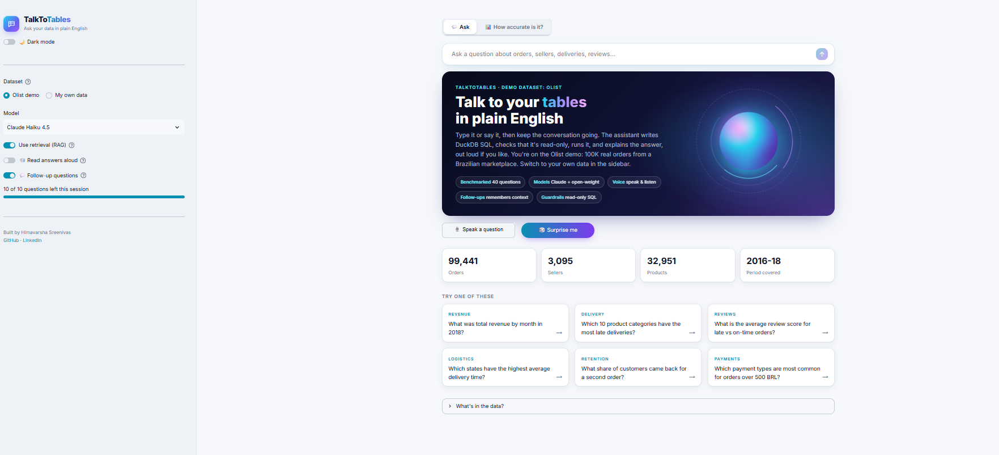
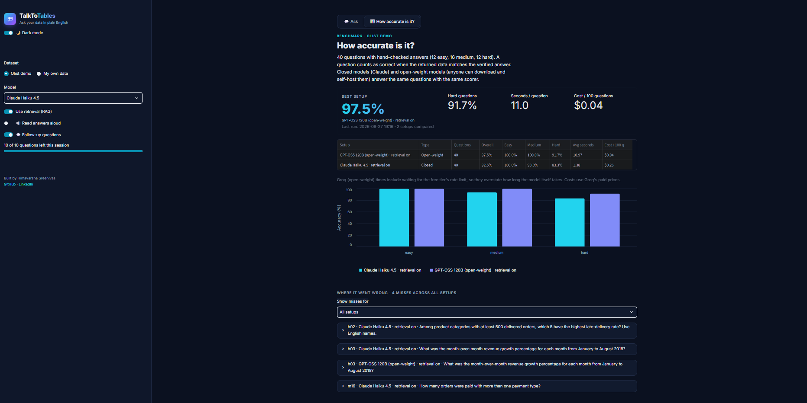
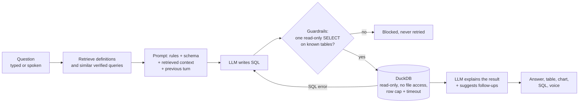

# TalkToTables

**Ask your data questions in plain English, by typing or talking.** TalkToTables writes DuckDB SQL, checks that it is read-only, runs it, and explains the answer (out loud if you like). It works on a benchmarked demo dataset (Olist, 100K real e-commerce orders) or on any CSV, Excel or Parquet files you upload.



## Results

Benchmarked on **40 questions with hand-checked answers** (12 easy, 16 medium, 12 hard) over the Olist data. A question counts as correct only when the returned data matches the verified answer.

| Model | Type | Retrieval | Overall | Easy | Medium | Hard | Cost / 100 questions |
|---|---|---|---|---|---|---|---|
| GPT-OSS 120B (via Groq) | Open-weight | on | **97.5%** (39/40) | 100% | 100% | 91.7% | $0.04 |
| Claude Haiku 4.5 | Closed | on | **92.5%** (37/40) | 100% | 93.8% | 83.3% | $0.26 |

What this shows, and what it doesn't:
- On this benchmark an open-weight model matched or beat a closed model at about 1/6 of the cost. A company that can't send data outside its own network could self-host a model like this.
- The gap is 2 questions out of 40, from one run each. It is evidence, not proof.
- Average latency: Claude Haiku 1.4 s per question. GPT-OSS times on Groq's free tier include waiting for rate limits, so they aren't a fair speed comparison.

### Where the models went wrong

The most instructive miss was a **join fan-out** bug (question h02, late-delivery rate by product category). The model joined orders to order items, then divided a late-order count taken per item row by a distinct-order count. Orders with several items were counted several times in the numerator, which inflated the rate for some categories and changed the top 5. The verified query de-duplicates order and category first. Every miss is shown side by side with the verified SQL in the app's *How accurate is it?* tab.



## Features

- **Plain English to SQL** with a short written answer, a results table and an automatic chart.
- **Conversational**: follow-up questions ("what about 2017?", "now split it by state") reuse the previous question and SQL. Each answer suggests three follow-ups.
- **Voice**: speak a question (browser speech recognition) and hear the answer read aloud (browser speech synthesis, with a voice and speed picker).
- **Bring your own data**: upload CSV, TSV, Excel or Parquet. Each file or sheet becomes a table, column names are cleaned to snake_case, the schema is described automatically, and the model suggests starter questions. Uploaded data lives in a private, read-only database for that session only.
- **Model choice**: Claude Haiku / Sonnet, open-weight GPT-OSS 120B / 20B and Qwen via Groq, or local models via Ollama. Adding a model is one entry in `src/config.py`.
- **Retrieval (RAG)** on the demo data: business definitions and similar verified queries are added to the prompt.
- **Cost controls**: a per-session question limit and token/cost shown on every answer.

## How it works



**Three layers of safety.** Generated SQL can't change or leak data:
1. `src/guardrails.py` parses the SQL with sqlglot and allows only a single SELECT on known tables. Writes, DDL, `read_csv`-style table functions, file paths and database-qualified names are rejected.
2. `src/db.py` opens DuckDB read-only with external access disabled and the configuration locked, so even SQL that slipped past layer 1 can't write or read files.
3. A row cap and a query timeout stop runaway queries.

If a query fails with a SQL error, the model gets one chance to fix it using the error message. Unsafe SQL is never retried.

## Project structure

```
app.py                 Streamlit app (Ask tab + benchmark tab)
src/
  assistant.py         question -> SQL -> guarded execution -> answer
  llm.py               one complete() function; providers: Anthropic, Groq (OpenAI-compatible), Ollama
  config.py            model registry, limits, paths
  guardrails.py        SQL safety checks (layer 1)
  db.py                read-only DuckDB with row cap and timeout (layers 2 and 3)
  retriever.py         RAG over verified queries and business definitions (embeddings or BM25)
  workspace.py         uploads -> private read-only DuckDB, schema description, suggested questions
  load_data.py         loads the 9 Olist CSVs with explicit types
  schema.md            schema, join paths and known traps given to the model
rag/                   verified example queries and business glossary
eval/
  questions.json       40 benchmark questions with verified SQL
  run_eval.py          runs models x retrieval settings, writes eval/results/
  results/             saved runs and the summary the app displays
tests/                 unit tests (run with pytest; no API calls)
sample_data/           small made-up sales files for trying the upload mode
```

## Run it locally

Requires Python 3.11+.

```bash
git clone https://github.com/hima24/talktotables.git
cd talktotables
python -m venv .venv
.venv\Scripts\activate          # Windows  (macOS/Linux: source .venv/bin/activate)
pip install -r requirements.txt
```

1. Download the [Olist dataset from Kaggle](https://www.kaggle.com/datasets/olistbr/brazilian-ecommerce) and unzip the CSVs into `data/raw/`.
2. Build the database: `python -m src.load_data`
3. Copy `.env.example` to `.env` and add at least one key (`ANTHROPIC_API_KEY` or `GROQ_API_KEY`).
4. Start the app: `streamlit run app.py`

The upload mode works without the Olist data: switch to *My own data* in the sidebar and upload the files in `sample_data/`.

## Benchmark it yourself

```bash
python -m eval.run_eval --check-gold                          # print every verified answer
python -m eval.run_eval --models claude-haiku --limit 5 --no-save   # cheap smoke test
python -m eval.run_eval --models claude-haiku --rag both      # with and without retrieval
python -m eval.run_eval --models gpt-oss-120b --rag on        # open-weight model via Groq
python -m pytest -q                                           # unit tests
```

Runs add up: each model and retrieval setup keeps its latest result in `eval/results/summary.json`, which the app's benchmark tab reads.

## Limitations

- The benchmark is 40 questions on one dataset, one run per setup.
- Uploaded data is not benchmarked and has no retrieval, since there are no verified queries for it.
- For uploaded data, column names, a few example values and query results are sent to the selected model provider.
- Voice features depend on the browser (best in Chrome and Edge). Speech recognition sends audio to Google's free speech service.

## Tech

Python · Streamlit · DuckDB · sqlglot · Anthropic Claude API · Groq (OpenAI-compatible API) · fastembed · Altair · pytest

---
Built by [Himavarsha Sreenivas](https://linkedin.com/in/himavarshas) · [GitHub](https://github.com/hima24)
